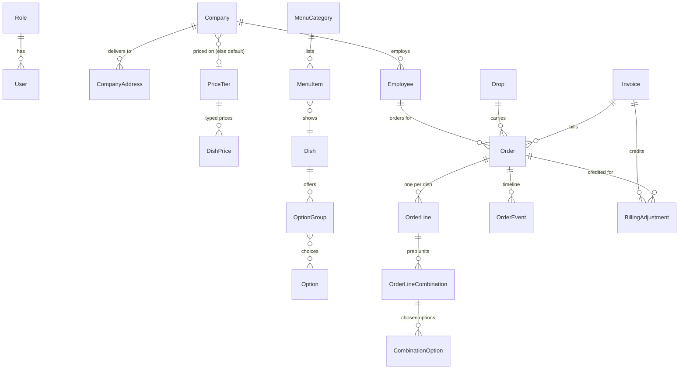

# Fernleaf Kitchen - kitchen operations admin panel

The internal admin panel of a commercial kitchen that runs corporate meal programmes. Staff
build the catalogue, menus and price tiers, set up companies and their employees, take orders
on employees' behalf, cook them station by station, dispatch and deliver them, and bill each
company. Employees never sign in - they are customers, kept as data.

**Live app: https://web-blue-xi-42.vercel.app** - it already holds two weeks of history,
today's kitchen in motion and the next days' orders, whichever day you open it
([Demo data](#demo-data)).

| Role     | Email             | Password  | Lands on                           |
| -------- | ----------------- | --------- | ---------------------------------- |
| Admin    | admin@test.com    | Test@1234 | Admin dashboard (everything)       |
| Kitchen  | kitchen@test.com  | Test@1234 | Kitchen dashboard, kitchen board   |
| Dispatch | dispatch@test.com | Test@1234 | Dispatch dashboard, dispatch board |
| Driver   | driver@test.com   | Test@1234 | My deliveries (today's own drops)  |

**Kitchen time zone: Asia/Kolkata.** Every delivery date, cut-off, "today", planned time and
on-time check is worked out in that zone, whatever the zone of the server (UTC on Render) or
the browser. It is one environment variable, `KITCHEN_TIME_ZONE`. Prices are US dollars,
stored as integer cents (the brief's examples are in $), pre-tax, with no fees.

## Contents

- [Run it locally](#run-it-locally)
- [Architecture](#architecture)
- [Data model](#data-model)
- [Key decisions and trade-offs](#key-decisions-and-trade-offs)
- [Dashboards](#dashboards)
- [Prioritisation](#prioritisation)
- [Ambiguities and how I read them](#ambiguities-and-how-i-read-them)
- [Demo data](#demo-data)
- [Deployment](#deployment)

## Run it locally

Needs Node 22.12+ and npm 10+. **No Docker and no database to install**: the sandbox starts a
real PostgreSQL from an npm package (`embedded-postgres`), applies the migration files, seeds
it and deletes it again when stopped.

```bash
npm install
npm run build                       # shared package, Prisma client, API and web

# terminal 1 - API on :4000 with a throwaway Postgres, seeded, demo data on
npm run sandbox -w @fernleaf/api

# terminal 2 - web on http://localhost:3000; /api/* is forwarded to :4000
cp apps/web/.env.example apps/web/.env.local
npm run dev -w @fernleaf/web
```

Against your own Postgres instead: copy `apps/api/.env.example` to `apps/api/.env`, apply the
SQL files in `apps/api/prisma/migrations/` in order (that is how the live Supabase database is
migrated - by hand, in its SQL editor), then `npm run db:seed -w @fernleaf/api` and
`npm run dev -w @fernleaf/api`. Set `DEMO_MODE=true` for the living demo data.

Checks, from the repo root - the same ones CI runs on every push:

```bash
npm run format:check
npm run lint
npm run typecheck
npm run test                        # unit tests (pure business rules)
npm run test:e2e -w @fernleaf/api   # API over HTTP against a throwaway Postgres - no setup
```

The seed only creates what is missing (matched by name, SKU or email) and never changes or
deletes anything, so it is safe to run against a database people are using.

## Architecture

```
browser ──> Next.js on Vercel ──/api/*──> NestJS on Render ──> PostgreSQL on Supabase
            (pages only)       rewrite    (every rule)          (43 tables, CHECKs, RLS on)
```

```
apps/web         Next.js 16 (App Router), React 19, Tailwind 4, TanStack Query.
                 Client components; no server actions, no API routes of its own.
apps/api         NestJS 12 + Prisma 7 (pg adapter). All business rules live here.
  src/domain       pure functions: cut-off calendar, pricing, menu resolution,
                   combinations, order rules, kitchen/dispatch rules - unit-tested, no DB
  src/<module>     auth, staff, settings, catalogue, pricing, menu, companies,
                   orders (+ cut-off), kitchen, dispatch (+ driver), billing,
                   dashboard, demo, health
packages/shared  zod request schemas, response types, money and time helpers -
                 imported by both apps, so a form and the API agree on every shape.
```

- **The server decides everything that matters.** The order form asks the API for a live quote
  as you type; the API recomputes the price and checks every rule again when the order is saved.
  Bypassing the form changes nothing.
- **One menu resolver** (`src/domain/menu.ts`) answers "what can this employee order, at what
  price?". The menu preview, the order form and order validation all call it, so they cannot
  disagree.
- **One clock** (`ClockService`): no business code calls `new Date()`. Tests freeze time to the
  minute (cut-off boundaries, late/at-risk), and the demo simulation replays past days with it.
- **One error shape**: `{ statusCode, code, message, fieldErrors[{ path, message }] }` from a
  single exception filter. Forms put each message on its field by path, e.g.
  `lines.0.combinations.1.choices`.
- **Boards poll** every 20 seconds (TanStack Query) instead of using websockets: fresh enough for
  a kitchen, and nothing extra to host.
- **A busy day stays fast.** A load test puts 440 confirmed orders on one day: the kitchen board
  API answers in about 80 ms (284 KB), and the page only lays out the cards on screen
  (`content-visibility`), so scrolling stays smooth.
- **Server-side pagination where lists grow with use**: orders (filtered by delivery date range,
  status, company and invoiced, plus search by number, employee name or email), employees and
  invoices. Companies, dishes, options and staff are short lists the kitchen curates by hand; they
  load whole, with in-page search.

### Access control

- **Permissions, not roles.** The code checks permissions (`ORDERS_WRITE`, `KITCHEN_WORK`,
  `DELIVERIES_OWN`, ...). A role is a database row holding a list of them, so a new role is a new
  row, never a code change. Even "who can be given a delivery" means "has `DELIVERIES_OWN`".
- **Denied by default.** A global guard runs on every request; a route must declare
  `@Public()`, `@Authenticated()` or `@RequirePermissions(...)`, or it answers 403. A test walks
  every route of the running app to prove none is undeclared.
- **Checked fresh on every request.** The session cookie (httpOnly, 12 h) only says who you are;
  the user and their role are reloaded each request, so switching someone off or changing a role
  takes effect at once.
- **Data scoping in the service, not the UI.** The kitchen and dispatch endpoints return no
  prices. A driver gets only their own drops for today; delivering anyone else's drop is a 404.
- The UI hides what a role can't use, but that is convenience only - the API refuses regardless,
  and the e2e tests check it with the four accounts.

## Data model

43 tables. Full schema with comments: [`apps/api/prisma/schema.prisma`](apps/api/prisma/schema.prisma).
The core:



- **Money**: integer cents everywhere; tier multipliers are integer basis points (2.4× = 24000);
  derived prices are computed with BigInt. No float ever touches a price.
- **Time**: a delivery date is a `date` (a kitchen calendar day), a delivery time is minutes after
  midnight, and every instant (cut-off, planned times, actual times) is a UTC `timestamptz`,
  converted in the kitchen zone with Luxon.
- **Snapshots**: an order keeps its company, tier, address text, packaging name and lead time; each
  line keeps the dish name, SKU, unit price and cost; each choice keeps the group, option and
  portion names and price. Editing the catalogue, prices or the company never changes a past
  order - and the ids stay linked for reporting.
- **A combination is a prep unit**: `OrderLineCombination` is both the priced combination of
  choices and the kitchen's unit of work (`kitchenStartedAt/By`, `kitchenDoneAt/By`). One table,
  so the kitchen cannot drift from what was ordered. A line holds one dish once; variety is
  combinations, and duplicate combinations are refused (a unique signature per line).
- **The company that pays is fixed at order time** (`Order.companyId`). Move the employee to
  another company and their past orders stay billed to the old one.
- **Drops are rows**, unique on (date, company, address, delivery time), holding the driver, the
  stage timestamps, the delivery note, the on-time result and the photo.
- **At most one invoice per order** is structural: `Order.invoiceId` is a single column.
- **Nothing that orders point at is deleted**: dishes, options, addresses, companies, staff and
  reference rows are switched off instead.
- **Rules the database itself enforces**: 35 CHECK constraints (for example: an invoice total
  equals its orders plus its adjustments; a drop can't be out for delivery without a driver; a
  combination's total is its quantity times its unit price; a price tier rule is complete; one
  settings row) and partial unique indexes (one default tier, one default address per company).
- **Row-level security** is on for every table with no policies, so Supabase's public data API
  can read nothing; the API connects as the owner.

## Key decisions and trade-offs

**Pricing is resolved on read.** A tier either has only typed prices, or derives them from
another value - "cost × 2.4" or "another tier + 15%". A typed price on a derived tier is an
override. Derived prices are computed when a menu or order needs them and rounded up to the next
5 cents at every step ($2.11 → $2.15; $2.15 stays). Nothing derived is stored, so nothing goes
stale when a cost or base price changes. Saving a tier rule that would loop (A from B from A) is
refused, under a database lock so two people can't close a loop between them.

**Missing price means hidden, never $0.** A dish with no price on the employee's tier is left off
their menu entirely; an option with no price is not offered; a dish whose required group has no
option left is hidden too, because it could not be ordered. An explicit $0 is a real price.
The tier grid shows every gap, with a "no price" filter.

**Cut-off is a pure function.** Count back N kitchen working days from the delivery date
(skipping kitchen non-working days and holidays), then take the cut-off time in the kitchen zone.
The company calendar decides which days can take deliveries; it never moves a cut-off. Tests cover
the brief's example (Wednesday, 2 days, 16:00 → Monday 16:00), holidays, weekends, 0 days and a
daylight-saving change (for a kitchen in a zone that has one).

**Cut-off processing is idempotent by construction.** For one date, in one transaction holding a
per-date advisory lock: drafts → cancelled, placed → confirmed (and put in their drops). It only
touches drafts and placed orders, so a second run, or two at once, finds nothing left. It runs 15
seconds after the API starts (the free host sleeps and misses ticks), then every 5 minutes, and by
hand ("Run now" on the Cut-offs page) for any date whose cut-off has passed. Each run is logged.

**Locks are checked against the clock, not the scheduler.** Whether an order can still be edited
is decided by comparing now with its cut-off, so a late processing run never lets anyone edit a
locked order. After the cut-off, only `ORDERS_OVERRIDE` (admins) can still change or place a draft
or placed order; an admin's late order waits for the next run to be confirmed - confirmation has
exactly one path.

**Price locking.** A draft is priced at today's prices every time it is saved. Placing an order
locks each combination's price; editing a placed order keeps the locked price of combinations
that were already there and prices new ones at today's prices.

**Concurrency, case by case:**

| Situation                                         | Mechanism                                                                                                                            |
| ------------------------------------------------- | ------------------------------------------------------------------------------------------------------------------------------------ |
| Two people edit the same order                    | `version` column; the stale save gets 409 "changed by someone else"                                                                  |
| Two people start or finish the same prep unit     | the order row is locked (`SELECT … FOR UPDATE`); the second gets 409 "already done by X at 10:42"                                    |
| The last two units finish at the same moment      | the same row lock: "kitchen ready" is set exactly once                                                                               |
| A drop step clicked twice, or skipped             | the drop row is locked; repeat → 409, skipped step → 422 with the reason                                                             |
| Cut-off run twice, or automatic + manual together | per-date advisory lock + status filters                                                                                              |
| Two invoices claim the same order                 | per-company advisory lock, then `UPDATE … WHERE "invoiceId" IS NULL AND status IN (…)`; a count mismatch rolls everything back (409) |
| Cancelling an order while it is being invoiced    | invoicing bumps the order's version, so the stale cancel fails instead of skipping its credit                                        |

The real races (two people finishing the same unit, the last two units at once, two cut-off runs at
once, two invoices for the same order) are e2e tests that fire both requests at the same moment;
the others are tested with the stale or repeated request.

**After an invoice is issued, it never changes** (except being marked paid). Changes that touch
money become credits (`BillingAdjustment`), placed on the company's next invoice:
cancelling or rejecting an invoiced order credits whatever is not credited yet, automatically; an
admin records a credit for a short delivery, capped at what is left of the order. Admin changes to
time, address or packaging don't touch money. An invoice can end up carrying only credits (a
negative total).

**Planned times are stored.** Dispatch-ready = delivery time − the company's lead minutes
(snapshotted on the order); kitchen-ready = dispatch-ready − 30 minutes. Both are worked out again
when an admin changes the delivery time. Late = past the planned time and not done; at risk = due
within the "at risk" setting (30 minutes).

**Drops follow their orders.** A changed time or address moves the order to the matching drop
(creating it if needed). A drop that gains an order after it was packed goes back to packing; an
order confirmed after its drop already left is listed on the dispatch board for an admin to
re-time. **On time** = delivered no later than the agreed time + a grace setting (10 minutes),
recorded once at delivery.

**Photos.** Delivery photos are shrunk in the browser and stored in Postgres - no storage service
to run; object storage would be next at real volume. Dish photos are real photos from Wikimedia
Commons, bundled with the web app and credited in
[`apps/web/public/dishes/CREDITS.md`](apps/web/public/dishes/CREDITS.md); a dish can also point at
any image URL.

**Tests.** 102 unit tests on the pure rules (money, pricing, cut-off calendar, menu resolution,
combinations, order and kitchen/dispatch rules, demo planning, CSV reading) and 125 end-to-end
tests of the API over HTTP against a real throwaway Postgres: sign-in and the permission matrix, every route
declaring its access, order pricing and snapshots, server-side validation, cut-off locks and
idempotency, kitchen and dispatch rules under concurrency, invoicing races and credits, dashboards,
the seed's rules and idempotency, CSV import, the demo simulation, and a 440-order kitchen board. No UI tests (the brief allows that).

## Dashboards

Each role lands on its own dashboard (chosen by the role's `homeDashboard`, which is data).
Shared rules for every figure:

- **Dates** are delivery dates in the kitchen's zone; "today" is the kitchen's today.
- **Meals** are the sum of order-line quantities.
- **Cancelled and rejected orders never count** - not as demand, not as money.
- **Money** is the order's stored total, at the prices it was placed at.

### Admin - "is today on track, and what needs a decision?"

| Figure                  | Exactly                                                                                                                                                                                                                                                |
| ----------------------- | ------------------------------------------------------------------------------------------------------------------------------------------------------------------------------------------------------------------------------------------------------ |
| Meals today             | Meals in confirmed + delivered orders delivering today; sub-line: the number of those orders, and any placed late by an admin that wait for the next cut-off run.                                                                                      |
| Delivered so far        | Meals in delivered orders today ÷ meals today (progress bar); drops delivered ÷ drops today. A drop counts if it carries at least one confirmed or delivered order.                                                                                    |
| On time                 | Today's delivered drops recorded on time ÷ today's delivered drops; "-" before the first delivery.                                                                                                                                                     |
| Late right now          | Confirmed orders not kitchen ready after their planned kitchen-ready time, plus drops not delivered that are either still not out after their planned dispatch time or past the agreed time + grace. Links to both boards.                             |
| Next cut-off            | The earliest cut-off still to come (looking three weeks ahead): its delivery date and lock time, the placed orders (and meals) it will confirm and the drafts (and meals) it will cancel unless someone places them.                                   |
| Overdue cut-off (alert) | Delivery dates whose cut-off has passed but still have drafts or placed orders - processing is due. Normally empty; it would show a stuck scheduler.                                                                                                   |
| Next 7 days             | Per delivery date, today to today + 6: meals confirmed (incl. delivered), placed and in drafts; "kitchen closed" days marked.                                                                                                                          |
| Billing                 | To invoice: total and count of confirmed + delivered orders on no invoice, any date. Credits waiting: pending adjustments. Unpaid: total and count of issued invoices, and the oldest one's issue date. Only for people with `BILLING_READ`.           |
| Data that needs fixing  | Per tier: active dishes with no price there (hidden from its companies' menus), with how many companies use the tier; active companies with no owner; active companies with no delivery address in use. Only with `PRICING_READ` and `COMPANIES_READ`. |

Not shown: margin (costs are typed by hand and go stale - the tier grid shows cost per item
instead), trend charts (a few weeks of data say little; honest tables over pretty charts),
per-employee figures (not a decision this person makes here).

### Kitchen - "what do I cook, where, and by when?" (the kitchen lead at 6 am)

Built from the kitchen board's own data for today and tomorrow, so the numbers always match the
board. No money anywhere.

| Figure              | Exactly                                                                                                                                                                |
| ------------------- | ---------------------------------------------------------------------------------------------------------------------------------------------------------------------- |
| Meals to cook today | Meals in finished prep units ÷ meals in all prep units of today's confirmed + delivered orders; plus the number of orders and units.                                   |
| Late                | Orders not kitchen ready after their planned kitchen-ready time.                                                                                                       |
| At risk             | Orders not kitchen ready whose planned kitchen-ready time is within the at-risk window (setting, 30 min).                                                              |
| Next deadline       | The earliest planned kitchen-ready time among orders not ready yet, and which order.                                                                                   |
| Stations            | Per station (the dish's current station; dishes without one under "Unassigned"): meals, units not started, cooking, done of total.                                     |
| Allergen watch      | Meals today containing each allergen (the dish's and the chosen options'); and every unit containing an allergy recorded for that employee, with the order and person. |
| What to batch       | Per dish, the meals in total, split into identical combinations of choices, biggest first.                                                                             |
| Tomorrow            | Confirmed meals per station for prep ahead, plus the meals placed but not confirmed until the cut-off runs.                                                            |

Not shown: money, billing, drivers, per-cook speed (start/done times exist, but timing people
invites the wrong incentives).

### Dispatch - "what leaves next, who takes it, what's late?"

Built from the dispatch board's own data for today.

| Figure         | Exactly                                                                                                                                                          |
| -------------- | ---------------------------------------------------------------------------------------------------------------------------------------------------------------- |
| Drops by stage | A drop's stage is the last step it reached: in the kitchen → kitchen ready (every order in it is kitchen ready) → dispatch ready → out for delivery → delivered. |
| On time        | Delivered drops recorded on time ÷ delivered drops, today.                                                                                                       |
| Needs action   | Drops out for delivery past the agreed time + grace; drops not out after their planned dispatch time (the earliest of their orders'); drops with no driver.      |
| Drivers today  | Everyone who can take deliveries: drops delivered ÷ drops assigned, and their next drop.                                                                         |

Not shown: money, kitchen detail beyond "kitchen ready", routes and maps (no geocoding in
scope), past performance (a dispatcher acts on today).

### Driver - "where do I go next?"

Today's own drops only, in time order: "x of y delivered", the next drop as a big card (time,
company, address with a maps link, meals, who it is for, the company's and the address's
instructions), then the rest. "Mark delivered" (with an optional note and photo) appears once the
drop is out for delivery. Not shown: prices, other drivers' drops, other days.

## Prioritisation

### Built

- Every **[Must]** of section 4: catalogue, menu, pricing, companies, employees, orders and
  cut-off, kitchen board, dispatch board and driver view, billing, settings, dashboards - each
  rule enforced by the API, with errors placed on the exact field.
- **[Should] portions**: options are sold in sizes with an extra charge (Regular, Large); an option
  group that uses sizes checks that every option it offers is sold in each of them.
- **[Should] CSV import of employees** (company → Employees → Import CSV, with a template to
  download): the API reads the file and checks every row with exactly the rules of adding one
  employee (email on the company's domain and not taken, names, yes/no flags, allergies and
  dietary preferences by name, duplicates within the file). Good rows are saved; each bad row is
  reported with its line number and what to fix - the file is never rejected as a whole.
- Section 7: money in integer cents, kitchen-zone time, the concurrency cases above, server-side
  pagination and filtering, tests for cut-off, pricing, combinations and invoicing, clean lint and
  type-check in CI.

### Skipped, and why

- **A role editor screen**: roles are rows and need no code to add, but there is no screen to
  create one - the Staff page shows each role's permissions read-only. The time went into rules.
- **Image upload for dishes**: a dish takes an image URL (or a bundled photo); upload would need
  object storage. Delivery photos show the upload path works.
- **Live push** (websockets/SSE): the boards poll every 20 seconds.
- Out of scope by section 5: payments, exports, accounting, tax, fees, coupons, notifications,
  audit logs (the order timeline covers each order's own history), a customer app.

### Next, with more time

- A role and permission editor, and an audit trail of admin overrides.
- Live updates on the kitchen and dispatch boards; virtualised lists for days far past 400 orders.
- Price history (who changed what, when) - orders already keep their own prices.
- Browser tests (Playwright) for the order form and the driver flow.

## Ambiguities and how I read them

1. **Valid delivery date**: a company working day that isn't a company holiday, and a kitchen
   working day that isn't a kitchen holiday (the kitchen cooks on the delivery day). Only the
   kitchen calendar moves cut-offs.
2. **Counting the cut-off**: the delivery day itself never counts. With 0 days the cut-off is on
   the delivery day at the cut-off time.
3. **"After the cut-off they cannot, except by an admin"**: admins (`ORDERS_OVERRIDE`) can still
   edit, place or cancel drafts and placed orders until processing confirms them. Once confirmed,
   the lines are fixed; an admin can change time, address or packaging, cancel, reject, or
   force-complete in the kitchen. Changing what was delivered is a credit, not an edit.
4. **Drafts** are checked like placed orders; the difference is commitment: no price lock, and
   cancelled at the cut-off. A draft can't be saved for a date that is already locked.
5. **Rejected** means the kitchen refuses an order (placed or confirmed, before it leaves), with a
   reason - distinct from a cancellation. Neither is billed.
6. **"Required" option group** = at least one choice. Every group has a maximum ("pick one
   protein"; an add-ons group can allow more).
7. **One line per dish per order**; variety lives in combinations, and two identical combinations
   on one line are refused - so one combination is exactly one prep unit.
8. **Minimum order quantity** applies to that dish's line on one order.
9. **Portion surcharges** are set per option and size, the same on every tier.
10. **Hiding an item** hides that menu item (the dish in that category). The same dish in another
    category stays visible. Hidden-for-a-company beats secret.
11. **Secret categories** are not listed, but their dishes are orderable by staff, and the preview
    shows them in their own "secret categories" section - being reachable is the point.
12. **Allergies don't hide dishes**: they are flagged in the preview, the order form and on the
    kitchen board.
13. **Employee emails** must be on one of their company's domains; a domain still used by an
    employee can't be removed. Public domains (gmail.com, ...) are a setting.
14. **The owner** must be an active employee of that company; reassign before moving or
    switching them off. **Moving an employee** is blocked while they have drafts or placed orders.
15. **Address, time and packaging flags**: without the flag, the order uses the company default.
16. **"Each step requires the previous one"** applies per drop: kitchen ready means every order
    in the drop is ready. Out for delivery needs a driver. Dispatch marks out for delivery; the
    assigned driver (or an admin) marks delivered.
17. **Holidays or switch-offs added after orders exist** don't cancel anything automatically;
    those orders stay for a person to decide.
18. **Kitchen working days** are all seven days in the demo (the brief gives no default for the
    kitchen; companies default to Monday-Friday as specified), so any review day has a "today".

## Demo data

The brief says the app must already hold realistic data **on whichever day it is reviewed**. A
one-off seed would be stale within a day, so the API keeps the demo kitchen alive itself.

**Master data** (`npm run db:seed -w @fernleaf/api`): the four roles and review accounts, extra
drivers and a cook (no password), reference lists, 33 dishes with real photos and 21 options
(sizes on rice), 11 categories (one secret, one switched off), 5 price tiers (Standard typed in;
Enterprise = Standard − 10% with one negotiated override; Premium = Standard + 15%; Partner =
cost × 2.4; Wellness typed in with deliberate gaps, so "missing price → hidden" is visible),
9 companies (one switched off) with ~230 employees - each with its own domains, addresses,
calendar, holidays, delivery defaults, tier and hidden items.

**Living orders** (`src/demo`, on when `DEMO_MODE=true`): 30 seconds after the API starts and
every 10 minutes, a simulation run

- **fills** every day from 14 days ago to 5 days ahead that has no simulated orders: about a third
  of each open company's staff order (fewer for days far ahead - orders trickle in until the
  cut-off), one or two dishes from their own menu, valid choices, the odd note or different time
  and address where their flags allow;
- **replays** each step at the moment it would really happen: orders placed two to five days
  before delivery, a few left as drafts or cancelled, cut-off processing at the cut-off, units
  cooked around their planned times (about one order in ten late), drops packed, sent out and
  delivered around the agreed time (some late - on-time figures are honest, not 100%), the odd
  order rejected, invoices every Monday, each paid 5 to 13 days later;
- **moves today along with the clock**: whatever should have happened by now has happened; later
  deliveries are still cooking. Today's drops for **driver@test.com** go out for delivery but are
  left for the reviewer to deliver.

How it stays honest: every change goes through the real services (`OrdersService`,
`CutoffService`, `KitchenService`, `DispatchService`, `BillingService`), so every business rule
applies; past days are replayed with the clock set to each step's moment
(`ClockService.runAt`), which only that code sees - real requests at the same moment see the real
time. It acts as its own staff account, "Demo simulator" (no password). It **never deletes
anything and never touches an order a person has acted on**: only orders it created, with no event
by anyone else, move along - and it never sweeps a person's credit into one of its invoices.
Its choices are seeded by date and order id, so a second run changes nothing; an e2e test checks
exactly that, and that a hand-started order is left alone.

## Deployment

- **Web**: Vercel (CDN, never sleeps), with `/api/*` rewritten to the API - the browser talks to
  one origin, so the session cookie is first-party and no CORS is needed.
- **API**: Render, Singapore, from [`render.yaml`](render.yaml) (Render has no India region). It
  is a long-running process because the cut-off scheduler and the demo simulation need one -
  Vercel functions can't run them, and running both apps on Render's free tier would mean
  cold starts for reviewers.
- **Database**: Supabase Postgres in the same region as the API (many queries per action; one
  India → Singapore hop per request). Migrations are the SQL files in `apps/api/prisma/migrations`,
  applied by hand in the SQL editor; Supabase is used as a database only (no Supabase Auth, no
  emails, public data API off).
- A keep-alive monitor pings `/api/health` every 5 minutes so the free API doesn't sleep through
  a review.
